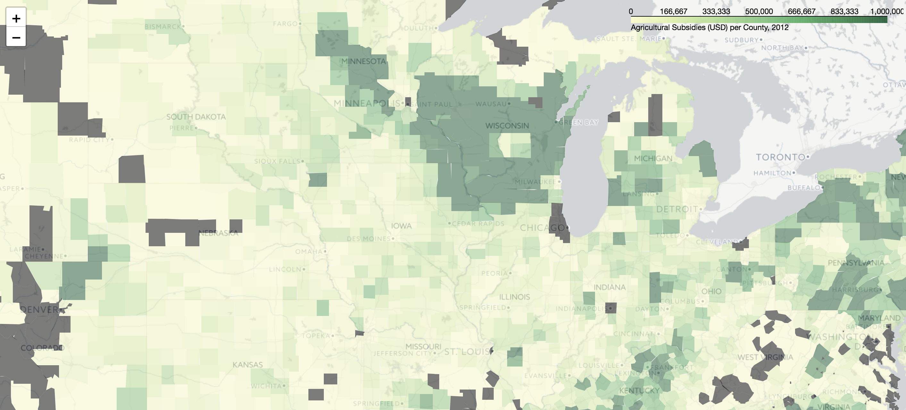
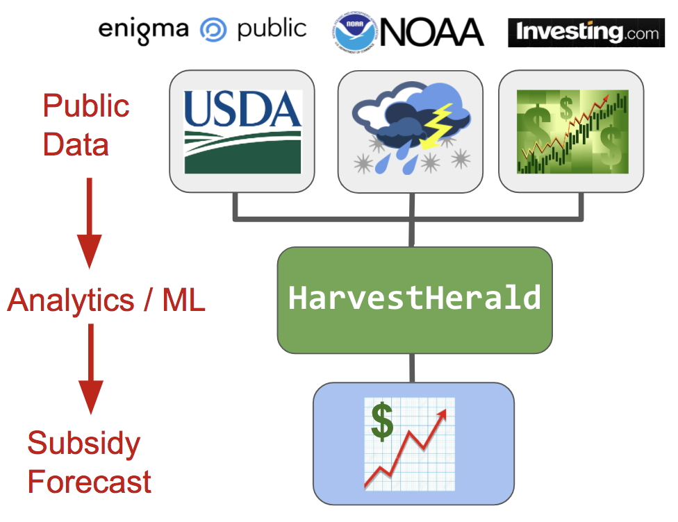
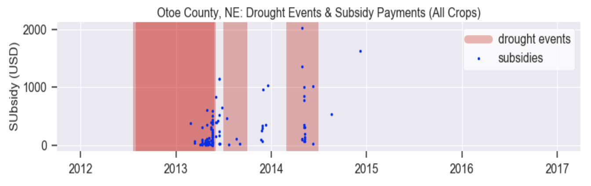
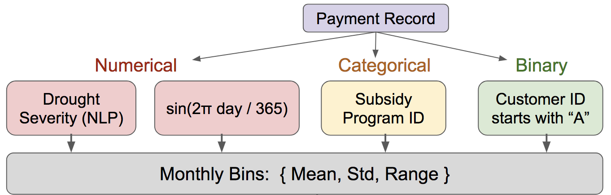
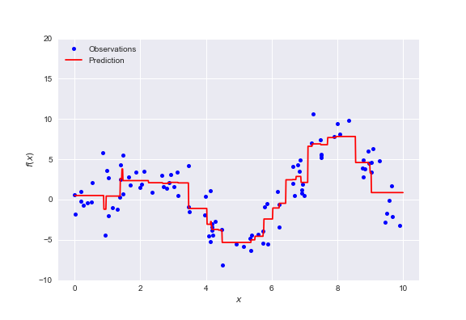
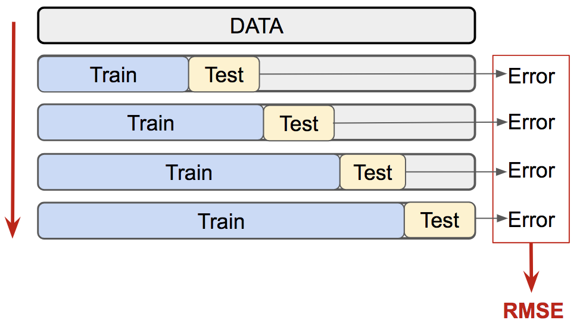
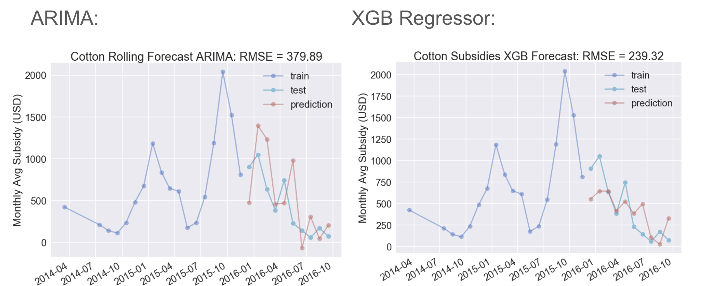
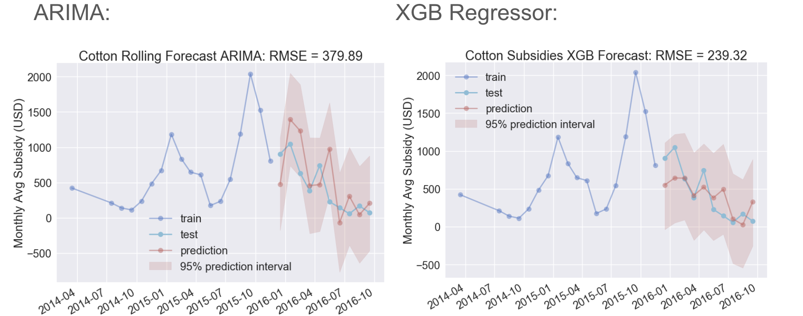

# HarvestHerald
## Using public data to forecast USDA farm subsidies

## Contents
1. [The Problem: Forecasting Farm Subsidies](#part1)
    * [Farm subsidies for people in a hurry](#part1.1)
    * [_HarvestHerald_](#part1.1)
2. [The Data](#part2)
    * [Historical subsidy, weather, and price data](#part2.1)
    * [Challenges posed by the data](#part2.2)
    * [The path forward: agrregation and monthly binning](#part2.3)
3. [Feature Engineering](#part3)
4. [Forecasting Models](#part4)
    * [The ARIMA model](#part4.1)
    * [The boosted regression tree model](#part4.2)
    * [Walk-forward validation](#part4.3)
5. [Results](#part5)
6. [Conclusions and Future Work](#part6)
7. [Installation Guide](#part7)

----

# 1. The Problem: Forecasting Farm Subsidies  

## Farm subsidies for people in a hurry

Since the devastation of the nation's agricultural industry during the Great Depression, the U.S. Department of Agriculture's Farm Service Agency (FSA) has guaranteed farmers a price floor for certain specific crops (e.g., cotton, corn, wheat, soybeans).  Other subsidy programs support farmers' crop loss insurance coverage, conservation efforts, product marketing, and a variety of other activities.  

Agricultural subsidies [reportedly total](http://www.npr.org/sections/thesalt/2016/02/01/465132866/farm-subsidies-persist-and-grow-despite-talk-of-reform) to more than $20 billion annually, and constitute a [significant cost in relation to other federal budget items](http://www.heritage.org/budget-and-spending/commentary/farm-subsidies-ripe-reform).  Forecasting the size of subsidy payments would be useful to at least two end users.  Most obviously, the USDA needs to anticipate budgeting shortfalls, allocate its resources efficiently, and generally set budgeting priorities.  A forecasting tool is also useful to crop loss insurers, as subsidies are a form of risk mitigation.

The size and nature of farm subsidy payments depend on a variety of interdependent factors:
  * If the crop is brought to market and sells below the price floor, the farmer receives a price support subsidy payment to make up the difference between the sale price and the price floor.  
  * If the crop sells above the price floor, the farmer receives no price support subsidy, but is happy to sell to the purchaser at a premium.  
  * If an adverse weather event or other natural disaster prevents the farmer from bringing the crop to market in the first place, the farmer receives no price support subsidy payment _and_ no payment for the crop.  Instead,  disaster subsidy payments allow the farmer to recoup large losses.  Federally-subsidized crop loss insurance also helps offset losses.

The map below displays the total agricultural subsidy for each U.S. county in 2012.  An interactive HTML version of the map is hosted in the `subsidy_map` folder on this repository:

## _HarvestHerald:_ a tool to forecast farm subsidies using public data sets 

This repository contains the Python code for _HarvestHerald_, a three-week project I undertook as a Fellow at [Insight Data Science](http://insightdatascience.com/).  _HarvestHerald_ builds forecasting models using public information from three categories of relevant data: farm subsidy payments, adverse weather events, and commodity futures prices.  

Presently the Congressional Budget Office produces only yearly forecasts of agricultural subsidy payments, which are updated every few months.  _HarvestHerald_ aims to provide dynamic forecasts on a monthly basis.  

# 2. The Data 

## Historical subsidy, weather, and price data 

__Subsidy data from Enigma Public__

The richest data available to us consists of a collection of annual farm subsidy payment records.  The records were obtained by [Enigma](https://public.enigma.com/) via Freedom of Information Act (FOIA) requests.  The [yearly data sets](https://public.enigma.com/datasets/u-s-farm-subsidies-producer-payment-reporting-system-2012/8be9024b-4ef6-4f74-85f4-242feeeecf18) contain the following information, among other items:
  * The __transaction date and amount__ for each IRS reportable payment made to producers
  * The __state and county__ of the farm ("customer") 
  * An __anonymized customer number__ for farm receiving the payment (akin to a taxpayer ID)
  * The __subsidy program__ and __relevant crop__

__Weather data from NOAA__

Weather data is available from the National Oceanic and Atmospheric Administration's [Storm Events Database](https://www.ncdc.noaa.gov/stormevents/ftp.jsp).  It contains the following information for every recorded storm event:
  * The __event type__ (e.g., drought, flood, tornado).  In this analysis __we focus solely on drought events,__ which are responsible for the bulk of crop damages as recorded in the NOAA database.
  * The __begin and end date__ of the event
  * The __state and county__ in which the event occured.
  * A one-paragraph __narrative description__ of the event.

Latitude and longitude values are also available for certain event types, but aren't used in this analysis.  They are unavailable for drought events.  Additionally, due to the USDA's customer anonymization, individual farm subsidy payments can be traced only to a specific state and county, and not to a location within the county.

__Commodity futures price data from Investing.com__

[Investing.com](https://www.investing.com/commodities/) provides historical futures prices for the "big five" subsidized crops (corn, cotton, rice, soybeans, and wheat) and for ethanol (for which much of the nation's corn supply is used) are available from Investing.com.  Daily records of the __trading volume__ and the __average, open, low and high price__ of each commodity future are available upon signing up for a free account.

## Challenges posed by the data 

Time series forecasting in general is known to be a difficult problem.  In this case the difficulty is compounded by challenges posed by the data:

__Unknown and variable time lags:__ 

The subsidy payment data contain the date of the _payment_ to the farm.  But the size of the subsidy depends on the date of the farmer's _loss_.  For price support subsidies, the date of loss is the date on which the farm sold the crop below the price floor.  __The lag between the loss and the subsidy payment is unknown,__ and can vary from months up to a year depending on the commodity, the subsidy program, and the time required to file and process the required paperwork.  As a result, __both the price and the volume of crop are unknown.__

I should give a big shout-out to [Enigma](https://www.enigma.com/), who contacted the USDA on my behalf to obtain this missing information.  It remains unavailable, but would likely improve the modeling substantially if it can be located.
  

__Data scarcity on a per-county basis:__ 

When I began this project I intended to focus on subsidy payments for an individual crop (e.g., corn) in individual counties.  The idea was to tie the adverse weather events in a single county to the size of the subsequent subsidy payments made to farms in the county.

A look at the data shows, however, that the subsidy payments within individual counties is sparse and noise-dominated, even when aggregating subsidies for all crop types.  When the models described below are used to forecast subsidies within individual counties, the forecasts yield little predictive value.  

## The path forward: agrregation and monthly binning 

To deal with the challenges described above, I attempted to aggregate enough data to produce sufficient signal for a forecasting model to sniff out.  I decided to __aggregate subsidy payment data across counties for a given crop, and to bin the data by month.__  I would then target the monthly average subsidy payment for forecasting.

My initial instinct was that forecasting would remain an intractable problem.  Aggregating and binning the data would reduce the variability of the subsidy payment samples, but also threatened to wash out any meaningful signal.  The effect of an adverse weather event, after all, is tied to crop yields in specific counties.  

Ultimately I decided to soldier on, with the hope that sufficiently clever feature engineering and model selection would yield useful results.

# 3. Feature Engineering 

Feature engineering involved designing more than 800 features relevant to the size of the subsidy payments.  Feature engineering proceeds in two steps:

  1. Generating new numerical, categorical, and binary features for each payment record
  2. Binning the records into one-month bins and recording the mean, standard deviation, and range of each feature

The engineered features for individual subsidy payment records included the following:
  * __Numerical:__ these included, by way of example,
    * The number of days of drought in the county, from the start of the year to the date of payment
    * The number of days into the year (out of 365) that the payment was made, modulated by a sine or cosine function to cycle at day 1/day 365
    * The mean, standard deviation, and range of crop futures prices during a 30-day lookback window preceeding a subsidy payment
  * __Categorical:__ One-hot-encoded features constituted the bulk of the 800+ engineered features.  These included, for example, 0s and 1s indicating the subsidy program type, the farm's state, and the farm's county.
  * __Binary:__ I added a single binary feature to indicate whether the "customer number" for the subsidy payment began with an "A" or with a "B".  I'm still tracking down what this precisely indicates, but suspect it relates to the type of farm receiving the subsidy payment (e.g., agricultural conglomerate vs individual farm).

The regression model uses the binned mean, standard deviation, and range values as parameters.  The idea is to provide the model with some sense of the distribution of feature values in each time bin, in the hope that this will provide enough signal to make meaningful forecasts.

# 4. Forecasting Models 

Being new to time stream forecasting, I made sure to consult several professional data scientists when selecting a  forecasting model.  They fell broadly into two camps:

__Camp 1: traditional statistical analysts.__  

Traditional analysts encouraged me pursue Auto-Regressive Integrated Moving Average (ARIMA) models, as these are a canonical, tried-and-true forecasting tool.  

They tended to intone strict maxims that can be loosely paraphrased as: 

> _Under no circumstances should you yield to the siren call of sophisticated regression 
> tree models.  Woe unto to him that does; they are hard-to-interpret black box algorithms 
> that offer little by way of illumination and understanding.  Bind yourself to the mast, 
> and forge ahead with ARIMA._

__Camp 2: machine learning enthusiasts.__ 

ML enthusiasts reacted rather differently.  They tended to speak in cheerful tones, and to say things like: 

> _Have you considered trying a boosted regression tree model?_

When informed of Camp 1's strong aversion to regression trees, they typically responded as follows: 

> _Boosted regression trees often perform much better than ARIMA models -- especially 
> in cases like yours, where although  the number of samples is small, the number of 
> features is large.  They may be harder to interpret, but fear not that which you do 
> not understand.  If a model yields superior performance, use it.  There are more things 
> in heaven and earth than are dreamt of in traditional analysts' philosophy._

Rather than choose between these competing camps, I ultimately decided to try both models.

## The ARIMA model 

Auto-Regressive Integrated Moving Average models use the structure of previous samples in a time series to generate forecasts of future time samples.  ARIMA models can be thought of as a predictive model in which the predicted value is a linear sum of of lags of the dependent variable and lags of the forecast errors:

predicted y = constant + [weighted sum of lagged values of y] + [weighted sum of lagged errors]

More formally, ARIMA models incorporate the following components:

  * __Auto-Regressive:__ the dependence between an observed sample and a specified number of lagged observation samples.
  * __Integrated:__  differencing the raw observation samples a specified number of times in order to make the time series stationary.  (A time series is [stationary](https://en.wikipedia.org/wiki/Stationary_process) if its parameters, such as the mean and variance, do not change with time.  Differencing helps to eliminate the trend and seasonality of the data.)
  * __Moving Average:__ the dependence between an observed sample and the residual errors from a moving average model applied to lagged observations.

Each feature above is specified in the model by setting a hyparameter:
  * ___p_ (lag order):__ the number of lagged terms to include.
  * ___d_ (degree of differencing):__ the number of times to difference the raw time stream.
  * ___q_ (order of moving average):__ the number of moving average terms to include.  For example, if _q_ is 3, the predictors for  will include , where  is the difference between the moving average at the $i$th sample and the observed sample value.

A specific model ARIMA(_p,d,q_) of a time series  can be written as:

where:
  *  is the backshift operator (for example, )
  *  are the parameters of the Auto-Regressive part of the model
  *  are the parameters of the Moving Average part of the model
  *  is a constant
  *  are white noise random errors (i.e., from a Gaussian distribution with zero mean).

Here the first parenthetical on the left is the AR(_p_) autoregressive component, the second parenthetical is the $d$ differencing component, and the right hand side is the MA(_q_) moving average component.

It is possible to select the optimal hyperparameters (_p, d, q_) through examining the autocorrelation and partial autocorrelation function plots for the raw and differenced time series, as outlined [here](http://www.seanabu.com/2016/03/22/time-series-seasonal-ARIMA-model-in-python/). Alternatively one can perform a grid search.  I opted for the latter approach.

I won't describe ARIMA models in further detail, but [this online textbook](https://www.otexts.org/fpp/8/5) and [these notes](https://people.duke.edu/~rnau/411arim.htm) are useful primers.  Some helpful ARIMA tutorials written in Python can be found [here](https://www.analyticsvidhya.com/blog/2016/02/time-series-forecasting-codes-python/), [here](http://www.seanabu.com/2016/03/22/time-series-seasonal-ARIMA-model-in-python/), and [here](https://machinelearningmastery.com/arima-for-time-series-forecasting-with-python/).  

## The boosted regression tree model 

Regression trees are decision trees that are designed to approximate functions with numerical output.  They can be used to approximate non-linear functions by sticthing together many regression models that are applied to small subsets of the data.  A regression tree model is built by:
  1. Recursively paertitioning the space of predictor variables into distinct, non-overlapping regions.  
  2. Generating a model at each terminal node that specifies the predictor/target viirable mapping for the partition.
  
Shown below is a regression tree model of a simplified data set with only one predictor variable .  The observed data (blue) is partitioned into multiple small regions; a model is fit for the data in each region; when the models are stitched together, the result (red) is a non-linear function that closely approximates the trend of the observed data:

<i>A single regression tree model for a simplified data set with one predictor variable.</i>

In practice a single regression tree is almost never used alone.  Instead, __ensembles of many trees__ are used to generate a more powerful model by combining several weaker tree models.  The "gradient boosting" method used by _HarvestHerald_ is an example ensembling method.

How does the model decide where to partition the predictor variables?  The partition edges are selected to minimize an _objective function_ consisting of a _loss term_  and a _regularization term_ :

The loss function in  quantifies how well the model fits the observed data.  The regularization term  penalizes models that are overly-complex to avoid overfitting.  In our case we use a "gadient boosted" regressor called XGBRegressor, with a mean square error loss function and L2 regularization.  

A "gradient boosting" algorithm seeks to mimimize the loss function by first using weak learners to make predictions (such as a greedily constructed decision tree), then adding new weak learners to the model to correct the residual errors of all previous trees.  Gradient descent is used to miminize the loss function. I won't descibe gradient boosting in detail here, but some helpful introductions to gradient boosted regression can be found in [this Python tutorial](https://machinelearningmastery.com/gentle-introduction-gradient-boosting-algorithm-machine-learning/) and [XGBoost's introductory documentation](http://xgboost.readthedocs.io/en/latest/model.html).  A clear explanation of gradient boosting using examples is available [here](http://blog.kaggle.com/2017/01/23/a-kaggle-master-explains-gradient-boosting/).

XGBRegressor includes multiple hyperparameters that can be tuned, including the number of trees to ensemble (`n_estimator`) and the maximum depth of the tree (`max_depth`).  _HarvestHerald_ performs an automated grid search for the optimal values.

## Walk-forward validation 

The randomized sampling cross-validation techniques typically used in many machine learning applications are unavailable for time series forecasting models.  This is because the samples in a time series are not independent.  A time series is autocorrelated: the value of a given sample is dependent on the value at other samples.  

Naively, one might try randomly sampling a cross-validation set, or maintaining the time order of the set while excluding randomly selected samples.  Due to autocorrelation in the time series, these methods would produce an unfair cross-validation:
  * Excluding a time sample does not remove all of its effect, as subsequent time samples are dependent on the excluded sample's value.
  * On the other hand, excluding a time sample may destroy autoregressive components on which the time series model depends.

Instead, time series forecasting typically validates a model by one of two methods:
  * __Train/test split:__ splitting the time series between training and test sets at a selected time sample (e.g., train on the first 70% of samples and test on the remaining 30%).
  * __Walk-forward validation:__ This involves dynamically retraining the model as new time samples are observed, as shown in the figure below for the case of an "expanding window":
    * Forecast only one step (or a small number of steps) into the future; 
    * Record the observed value and the error; 
    * Add the observed value to the training set for the next forecast step;
    * Report the root-mean-squared error (RMSE) as a measure of the model's performance on varying time scales.

I decided to use walk-forward validation for this project, as this is how such a model would be used in real life: the model would be updated and re-trained as new data samples are observed.

# 5. Results 

How do the ARIMA and XGBRegressor models fare when tested?  Here are the results for the two, displayed side-by-side:

Despite the substantial error at each time sample, the predictions for each (red) follow the overall trend of the test set (cyan).  The XGBRegressor model also seems to be faring somewhat better than the ARMA model: the RMSE is smaller.

Note that the results seem reasonable, despite the challenges posed by the missing information (see Part 2 above) and the required monthly binning.  But as any good physicist can tell you, predictions are meaningless if they don't come with error bars.  Let's see what these plots look like when we include a 95% confidence interval:

The 95% confidence interval is rather large: it spans most of the range of the training data itself.  This means we should take our predictions with a hefty grain of salt.

# 6. Conclusions and Future Work 

## Utility assessment

The large confidence intervals indicate that the model predictions cannot be used as precise indicators of average monthly subsdy payments.  The sizes of the confidence intervals are perhaps unsurprising, as crucial information is missing from the subsidy payment data set.

Still, the models may prove useful to end users: they generally follow the trend of the test data, are generally within a factor of 2 of the true observed values, and do provide a sense of the overall motion of monthly subsidy payments.  

## Future improvements

This project was completed on an ultra-tight timeline of less than three weeks.  With more time, several avenues for improvement might be explored:
  * __Tracking down vital missing information.__  This is by far the most crucial possible improvement.  If payments can be narrowed to a specific date, the unknown and variable lag between a farm's loss and subsidy payment would be eliminated.
  * __Switching from ARIMA to an ARIMAX.__  ARIMAX models allow for multivariate regression using exogenous data.  Had I been aware of ARIMAX at the start of the project, I would have selected it over ARIMA.
  * __Principal Components Analysis.__  PCA can be used to select the most important features.  The models could then be re-tested and compared to the results above.
  * __Incorporating economic forecasts of price movements.__  Economic forecasts tend to be uncertain, but a range of forecasted values might be produced using a range of price forecasts.

# 7. Installation Guide 

Installing _HarvestHerald_ requires the following steps:

  1. __Install the required Python libraries__ listed in the [requirements.txt file](https://github.com/derekaraujo/HarvestHerald/blob/master/requirements.txt).
  2. __Install [PostgreSQL](https://www.postgresql.org/)__ to allow you to build a SQL data base from the raw data files.
  3. __Obtain the required raw data files.__ The raw weather and subsidy data files are available in this repository's [`data` folder](https://github.com/derekaraujo/HarvestHerald/tree/master/data).  __The historical commodity futures data is not posted here__, as they are available from [Investing.com](https://www.investing.com/commodities/) only upon signing up for a free account.  Once you do so, you can download the relevant files from the following links (CME or CBOT ticker symbol indicated in parentheses) and place them in the `data` folder:
      * Ethanol (1ZEc1) (relevant to corn): https://www.investing.com/commodities/ethanol-futures-historical-data
      * US Corn (ZCZ7): https://www.investing.com/commodities/us-corn
      * US Cotton #2 (CTZ7): https://www.investing.com/commodities/us-cotton-no.2-historical-data
      * US Wheat (ZWZ7): https://www.investing.com/commodities/us-wheat
      * Rough Rice (RRX7): https://www.investing.com/commodities/rough-rice-historical-data
      * Soybeans (ZSX7): https://www.investing.com/commodities/us-soybeans-historical-data
  4. __Run the autmated run.py executable.__  This will build the SQL database using the code in the `data_cleaning` folder; engineer features using the code in the `feature_engineering` folder; build, train, and test the ARIMA and XGBRegressor models contained in the `forecasting` folder; and generate the accompanying plots.

----
[slides](https://docs.google.com/presentation/d/e/2PACX-1vShzJQ-ZkOaOpKg9Dby7Ux3zdj9SZ4WTNTnmrm-t-6vZ47UHjGT31Hm4QKcGWuCJqoCKLwi3PWSUmlQ/pub?start=false&loop=false&delayms=3000)
